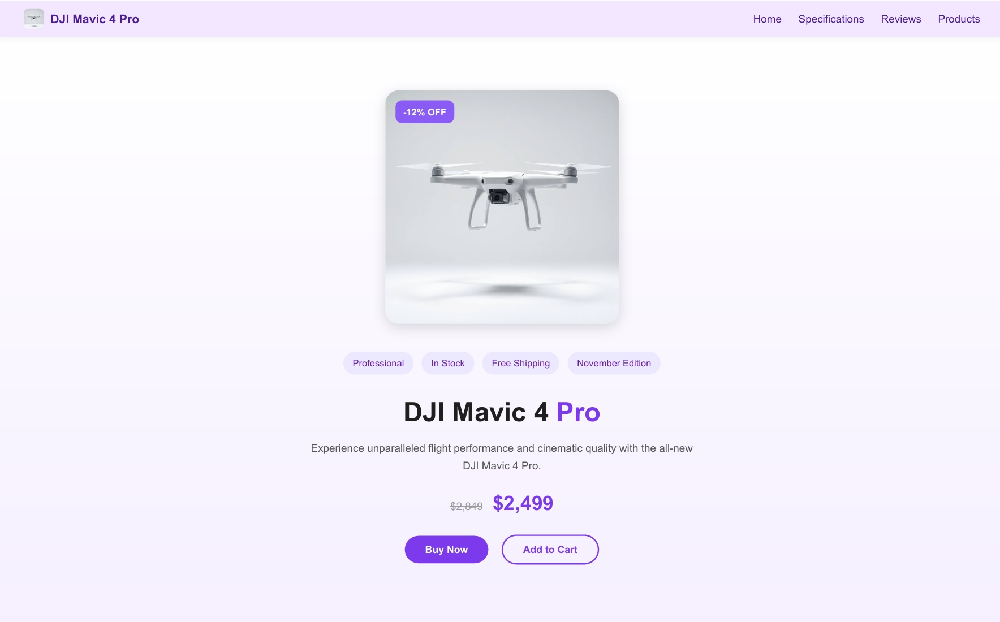
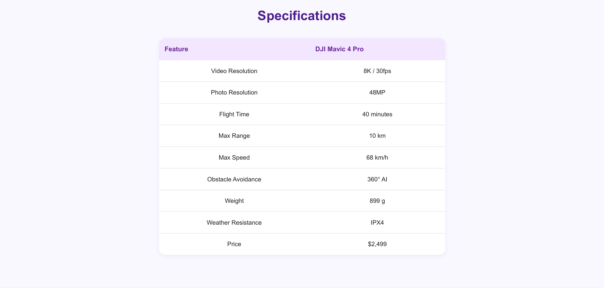
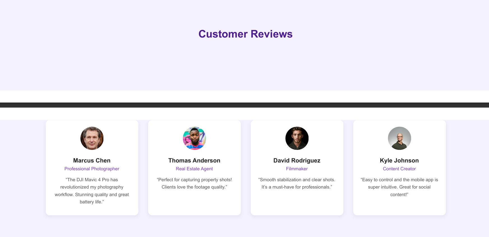
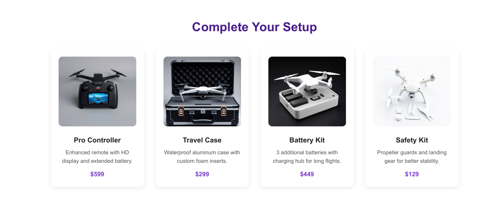

## DJI Mavic 4 Pro 

The DJI Mavic 4 Pro Product Page is a modern, single-page landing layout built with HTML and CSS.
It is designed to showcase a high-end drone product in a clean, marketing-focused format that mirrors real e-commerce and tech-brand product pages.

This project highlights structured layout design, visual hierarchy, and product storytelling, with dedicated sections for specifications, customer reviews, related products, and payment options.

## Project Overview

The page follows a clear, conversion-oriented structure:
 • Sticky navigation bar with anchor links to key sections
 • Hero section presenting the product, discount, tags, and pricing
 • Specifications table with technical details in a clean, readable format
 • Customer review cards with roles and testimonials
 • Related products grid for accessories and upsell items
 • Footer with legal text and payment method logos

The goal is to demonstrate how to design a focused product page that balances aesthetics with clarity and usability.

## Project Preview

## Key Features

##  • Sticky Navigation Bar
Keeps key links (Home, Specifications, Reviews, Products) accessible while scrolling.
##  • Prominent Hero Section
Large product image with discount badge, status tags, pricing, and clear “Buy Now” and “Add to Cart” buttons.
##  • Detailed Specifications Table
Structured technical data for resolution, flight time, range, speed, and other hardware features.
##  • Customer Review Cards
Four testimonial cards with avatars, roles, and quotes to build trust and credibility.
##  • Related Products Grid
Accessory cards for controller, travel case, battery kit, and safety kit, each with description and price.
##  • Payment Methods Block
Footer section showcasing PayPal, MasterCard, and Visa logos with subtle hover effects.
##  • Consistent Visual Identity
Soft purple palette, rounded cards, shadows, and typography that match a modern tech brand.
 ## • Responsive Adjustments
Layout tweaks for smaller screens using media queries to keep cards and sections readable.

## Technologies Used

 • HTML5 for semantic page structure
 
 • CSS3 for layout, styling, responsiveness, and hover effects
 
 • Git/GitHub for version control and project management

No JavaScript or frameworks are used.
All interactions and visuals are handled with pure HTML and CSS.

## What This Project Demonstrates

 • Ability to design and implement a complete product landing page from scratch
 • Strong understanding of layout composition, spacing, and content hierarchy
 • Experience presenting technical specifications and marketing content together in a balanced way
 • Skill in building responsive card-based layouts for reviews and related products
 • Clean, maintainable front-end structure suitable for portfolio and client work

## Developer

Teef M. Karyry — TeefDev
